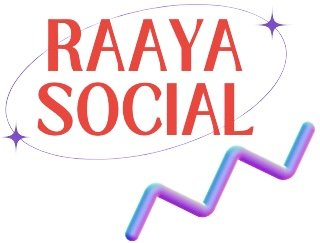

# RAAYA.Social - Short-Form Video Content Platform



## 📋 Project Overview

RAAYA.Social is a modern, responsive landing page for a creative social media content agency that specializes in short-form video content production. The platform offers tailored social media content packages starting at $99/month, helping businesses and personal brands create engaging video content for various social media channels.

### 🎯 Key Features

- **Responsive Design**: Fully responsive layout that works seamlessly across desktop, tablet, and mobile devices
- **Mobile Navigation**: Hamburger menu for optimal mobile browsing experience
- **Interactive FAQ Section**: Expandable/collapsible FAQ items with smooth transitions
- **Service Showcase**: Comprehensive display of creative services and packages
- **Video Categories**: Dedicated sections for business and personal brand video content
- **Social Media Integration**: Showcase of supported social channels (Instagram, TikTok, YouTube, etc.)
- **Contact Form**: Integrated contact form in the footer for inquiries

### 🛠️ Technologies Used

- HTML5
- CSS3 (with custom styling)
- JavaScript (vanilla)
- Font Awesome Icons
- Google Fonts (Inter, Nunito, Poppins, Raleway)
- SVG Graphics

## 🚀 Live Demo

Visit the live site: [RAAYA.Social](https://rayaa-social-beta.vercel.app/)

## 📁 Project Structure

## 💻 Sections

1. **Header/Navigation**: Responsive navbar with mobile toggle
2. **Hero Section**: Value proposition with pricing highlight
3. **Social Channels**: Partner platforms showcase
4. **Featured Brands**: Client logos marquee
5. **Services**: Comprehensive creative service offerings
6. **Video Features**: Three-step video creation process
7. **Platform Support**: Supported video platforms grid
8. **Video Categories**: Business and personal brand video examples
9. **Why Short Videos**: Educational content section
10. **FAQ**: Interactive frequently asked questions
11. **Footer**: Company info, quick links, services, and contact form

## 🎨 Design Features

- Modern gradient typography
- Clean, professional color scheme
- Card-based layout for services
- Interactive hover effects
- Mobile-first responsive design
- SVG icons and custom graphics

## 📱 Responsive Breakpoints

- Desktop: 1200px+
- Tablet: 768px - 1199px
- Mobile: < 768px

## 🔧 Installation & Setup

1. Clone the repository:
```bash
git clone https://github.com/yourusername/raaya-social.git
